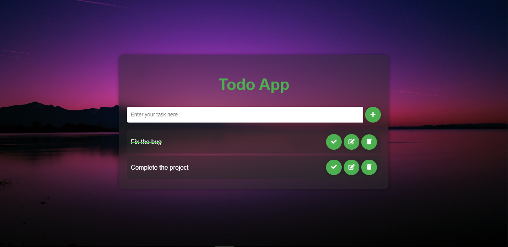

# Todo App

A simple and effective Todo App built using HTML, CSS, and JavaScript.

## Features

- **Add Tasks:** Quickly add new tasks to your todo list.
- **Delete Tasks:** Remove tasks that are completed or no longer needed.
- **Mark as Completed:** Check off tasks when they are completed.
- **Persistent Storage:** Tasks are saved in the local storage, so they persist even after refreshing the page.

## Screenshot


## Installation

1. **Clone the repository:**

   ```sh
   git clone https://github.com/Muhammad-Ibrar727/Todo-App.git
